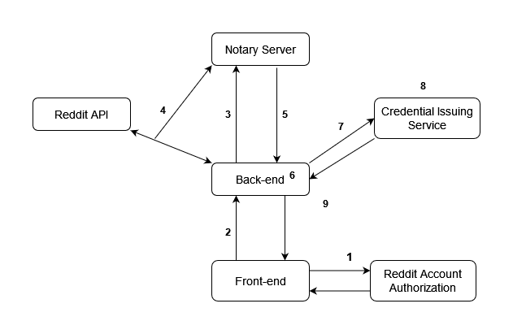

## VC Notary

This project is a demonstration of using the TLS Notary protocol to attest to user account specific data fetched from an API and process those results into a verifiable credential. 

Specifically, the Reddit API is used to fetch information on which subreddit a user is a moderator of and then a verifiable credential stating this is issued to them using their desired DID. The motivation for this choice is based in the understanding that this responsibility is a signal of trust already having been issued to this individual. This enables users to transform their existing trusted role into a verifiable credential.

The project relies on three seperate services: the primary full stack application, a notary server, and a credential issuing service. 

### Architecture and Application Flow

1. The user inputs their DID and clicks the "Get Your VC" button. They are redirected to Reddit to authenticate. They are then redirected back to the application with an authorization code.
2. The authorization code along with the user's DID are sent to the back-end server. The authorization code is exchanged for an access token.
3. Initiate connection with the notary server.
4. Initiate TLS session with the Reddit API. The notary server engages in the MPC protocol with the back-end server to attest to the encryption of the request and decryption of the response, while remaining blind to the plaintext data.
5. The back-end receives a signed attestation from the result of the MPC protocol.
6. The back-end prepares a verifiable presentation of the plaintext data received from the TLS session.
7. This is sent to the credential issuing service along with the user's DID. 
8. The credential service verifies the presented data. If valid, the appropriate information (Subreddit name) is extracted from the response data and used to issue a verifiable credential.
9. The verifiable credential is returned to the front end and displayed to the user.

### Requirements

- Rust
- Node.js

### Setup

- A Reddit Web Application must be created: https://www.reddit.com/prefs/apps/
- Testing requires an account that is a moderator of at least one subreddit (only one is processed at this time)

- Clone repository
- Install `tlsn` submodule: `git submodule update --init`
- Set `tls: enabled: false` in `tlsn/crates/notary/server/config/config.yaml`

### Running the project

- Front-end: refer to `front-end/README.md`
- Back-end: refer to `back-end/README.md`
- Issuer Proxy: refer to `issuer/README.md`
- Credential Service: refer to `issuer/credential-service/README.md`
- Notary Server: Navigate to `tlsn/crates/notary/server` and run `cargo run --release`
